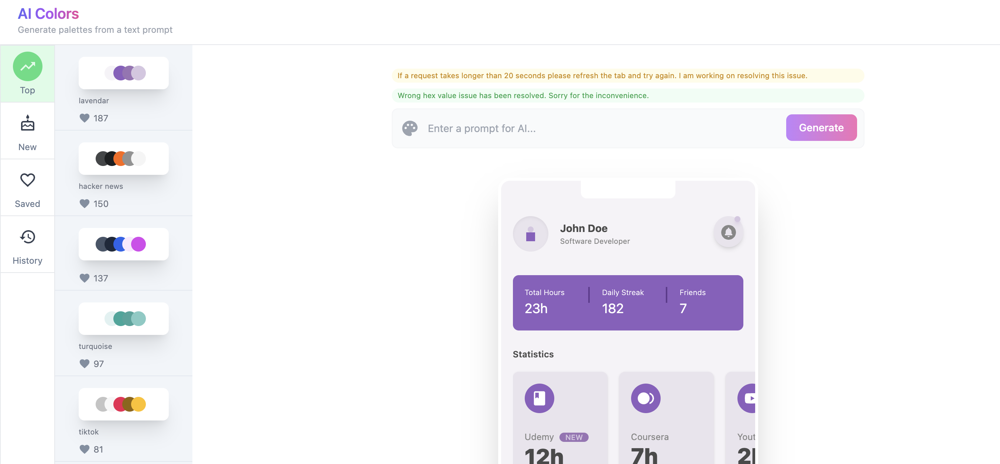
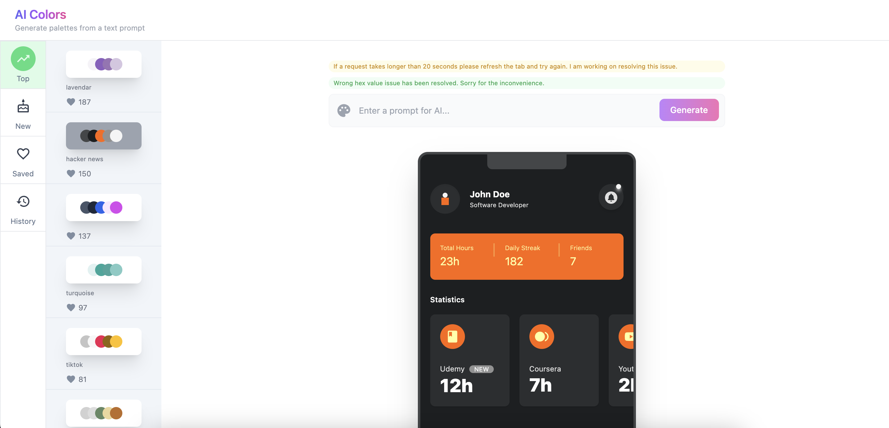
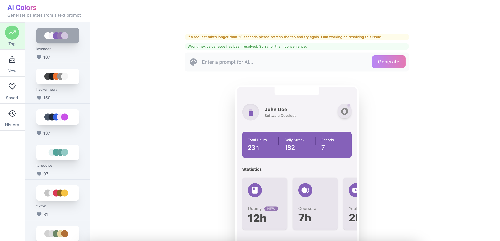
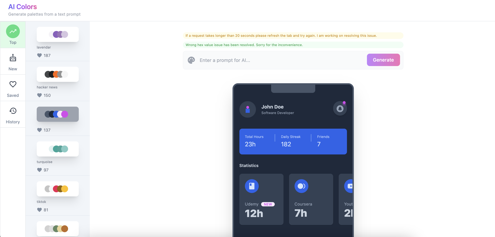

# AI Colors










This project uses [Nuxt 3](https://v3.nuxtjs.org).

## Setup

Make sure to install the dependencies :

```sh
pnpm install
```

## Development

Start the development server on http://localhost:3000 :

```sh
pnpm dev
```

## Production

Build the application for production :

```sh
pnpm build
```

## Deployment

Checkout the [deployment documentation](https://v3.nuxtjs.org/docs/deployment).
